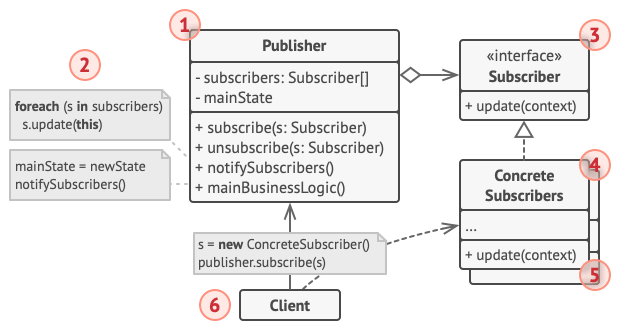

## Observer Pattern?

옵저버 패턴은 주체가 어떤 객체의 상태 변화를 관찰하다가 상태 변화가 생길 때 마다 method 등을 통해 옵저버 목록에 
있는 옵저버들에게 변화를 알려주는 패턴이다.
- 여기서 주체란, 객체의 생태 변화를 보고 있는 관찰자이며, 옵저버들이란 이 객체의 상태 변화에 따라 전달되는 method 
등을 기반으로 “추가 변화 사항”이 생기는 객체들을 의미한다.
- 주체와 객체를 따로 두지 않고 생태가 변경되는 객체를 기반으로 구축하기도 한다.

옵저버 패턴을 활용한 서비스의 대표적인 예는 Twitter이다.
- 만약 내가 어떤 사람이 주체를 “팔로우” 했다면, 주체가 포스팅을 올릴 시에 알림이 “팔로워”에게 가게된다.

또한, 옵저버 패턴은 주로 이벤트 기반 시스템에 사용되며, MVC (Model-View-Controller) 패턴에도 사용된다.
- 예를 들어, 주체라고 볼 수 있는 model에서 변경 사항이 생겨 method를 통해 옵저버인 view에게 알려주고, 이를 
기반으로 controller가 작동하는 것이다.

 

## 구조

옵저버 패턴의 전체적인 구조는 다음과 같다.

1. **Publisher**: 관찰의 대상자가 되는 객체이다. Subject라고도 불리며, Subsriber(Observer)들을 합성을 사용해 배열 혹은 리스트로 갖는다.
    - Publisher 인터페이스를 만들고, 이를 구현하는 ConcretePublisher를 생성하는 방식을 사용할 수도 있다.

2. 새로운 이벤트가 발생하면 Publisher는 소유하고 있는 Subscriber들에게 Subscirber 인터페이스로 선언된 메서드를 
통해 알림을 보낸다.

3. **Subscriber**: Observer라고도 불리며, 구독자(관찰자)들을 하나로 정의하는 인터페이스이다.

4. **ConcreteSubscriber**: Subscriber 인터페이스를 구현한 객체이다. Publisher가 알림을 보내면 이에 대한 
응답으로 여러 작업을 수행한다.
5. 

6. **Client**: ConcreteSubscriber를 생성하고, 이를 Publisher에 등록한다.

 

## 장단점

### 장점

- Publisher의 상태 변경을 주기적으로 조회하지 않고 자동으로 감지할 수 있다.
- OCP 준수 - Publisher의 코드를 변경하지 않고도 새 SubScriber 클래스를 도입할 수 있다.
- 런타임 시점에 Publisher와 구독 알림 관계를 맺을 수 있다.
- 상태가 변경되는 주체와 변경을 감지하는 객체의 관계를 느슨하게 유지할 수 있다.

### 단점

- Subscriber는 알림을 무작위 순서로 받게 된다.
- 규모가 커지면 구조와 동작을 알아보기 힘들어 코드의 복잡도가 증가한다.

 

## 출처
https://refactoring.guru/ko/design-patterns/builder