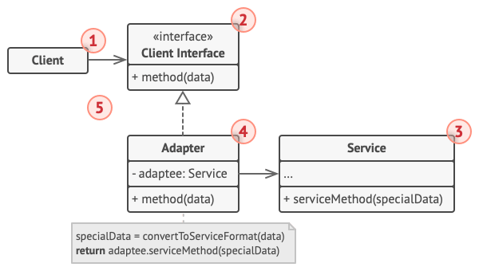
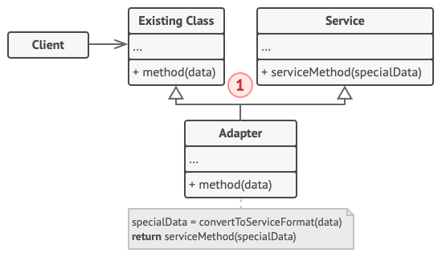

## Adapter Pattern?

어댑터 패턴은 호환되지 않는 인터페이스를 가진 객체들이 협업할 수 있도록 만드는 디자인 패턴이다.

이미 구축되어 있는 것을 새로운 것에 사용할 때, 양쪽의 호환성을 유지하기 위해 사용한다. 이로서 호환성뿐만 아니라 
신규 기능을 확장하는데도 유용하게 쓰이는 패턴이다.

 

## 구조

어댑터 패턴은 기존 구현체를 합성을 사용하느냐, 상속하느냐에 따라 두 가지 구조로 나뉜다.

### Object Adapter(객체 어댑터)

- 합성된 멤버에게 위임을 이용한 어댑터 패턴이다.
- 합성을 사용했기 때문에 런타임 중에 Adaptee가 결정되어 유연하다.
- 하지만 Adaptee가 되는 객체를 멤버 변수로 저장해야 하므로 그만큼의 공간을 차지한다.

1. **Client**: 기존에 이미 존재하는 로직을 포함하는 클래스이다.

2. **Client Interface**: 다른 클래스들이 클라이언트와 공동 작업할 수 있도록 따라야 하는 인터페이스이다. 
Adapter는 해당 인터페이스를 통해 어댑터 기능을 제공한다.

3. **Service(Adaptee)**: 어댑터를 통해 호환하고자 하는 클래스이다.

4. **Adapter**: 어댑터 역할을 수행하는 클래스이다. Client와 Service 양쪽에서 사용이 가능한 클래스로, Service 
객체를 래핑하고 Client Interface를 구현한다.

5. Client는 호환성 문제 때문에 Service를 직접적으로 사용하지 못한다. 꼭 Adapter를 통해서만 Service를 사용할 수 
있는데, Adapter는 Client Interface를 구현한 상태이기 때문에 Adapter 구현체에 의존하지 않아도 Adapter를 통해 
Service 이용이 가능하다.
    - 새로운 유형의 Adapter를 도입해도 Client 코드를 변경할 필요가 없기 때문에 매우 유연하게 동작하게 된다.

### Class Adapter(클래스 어댑터)

- 클래스 상속을 사용한 어댑터 패턴이다.

- Adapter가 Service(Adaptee)를 상속하는 방식이기 때문에 따로 객체 구현없이 바로 코드 재사용이 가능하다.

- 보통 다중 상속을 지원하는 프로그래밍 언어에서만 구현이 가능하다.
    - Java에서는 인터페이스와 클래스를 병합하여 다중 상속을 어느 정도 구현 가능하지만, 전반적으로 권장하지 않는다.

1. 클래스 어댑터는 Client와 Service 양쪽에서 상속을 받기 때문에 객체를 래핑할 필요가 없다. 어댑터 기능은 
오버라이딩된 메서드를 통해 진행된다.

 

## 장단점

### 장점

- 기본 비즈니스 로직에서 인터페이스 또는 데이터 변환 코드를 분리할 수 있기 때문에 SRP(단일 책임 원칙)을 만족한다.

- 기존의 클래스를 변경하지 않고 클라이언트 인터페이스를 통해 어댑터와 작동하기 때문에 OCP(개방-폐쇠 원칙)을 만족한다.

- 다른 형태의 어댑터가 필요하다면 만든 후 바로 변경이 가능하다. 문제가 발생할 경우, 어댑터를 집중적으로 살펴보면 
되기 때문에 관리 포인트가 줄어든다.

### 단점

- 새로운 인터페이스와 어댑터를 도입해야 하기 때문에 코드의 복잡성이 증가한다.

- 어댑터를 적용하는 것보다 간단하게 Service를 변경하는 것이 더 효율적일 수 있기 때문에 어댑터 사용을 신중하게 
고민해야 한다.

 

## 출처
https://refactoring.guru/ko/design-patterns/builder