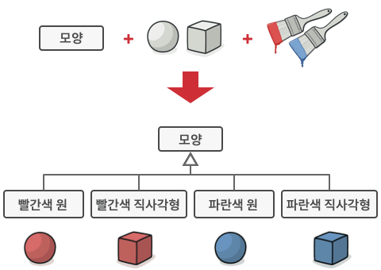
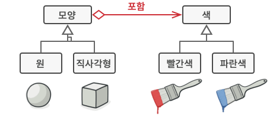
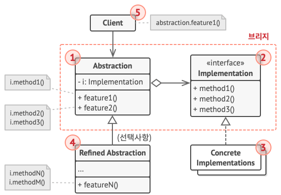

## Bridge Pattern?

브릿지 패턴은 큰 클래스 또는 밀접하게 관련된 클래스들의 집합을 두 개의 개별 계층 구조(추상화 및 구현)로 나눈 후, 
각각 독립적으로 개발할 수 있도록 만드는 디자인 패턴이다.

예를 들어, 아래와 같이 여러 모양과 여러 색상을 합쳐 여러 색을 가진 모양을 만든다고 가정하자.

만약, 여기서 새로운 모양이나 새로운 색상이 하나라도 추가되면 그에 따라 추가해야 하는 자식 클래스는 점점 늘어나게 된다.

위의 문제를 브릿지 패턴을 통해 아래와 같이 해결할 수 있다.

 

## 구조

브릿지 패턴의 전체적인 구조는 다음과 같다.

1. **Abstraction**: 상위 수준의 제어 논리를 제공하며, 구현 객체에 의존해 실제 하위 수준 작업들을 수행한다.

2. **Implemetation**:  모든 Concrete Implementation들에 공통적인 인터페이스를 선언한다.
    - Abstraction은 여기어 선언된 메서드들을 통해서만 구현 객체와 소통이 가능하다.

3. **Concrete Implementation:** Implementation을 실제로 구현한 맞춤형 코드가 포함된다.

4. **Refined Abstraction**: 정제된 추상화로, Abstraction의 로직을 변형하여 제공한다. 이는 생략이 가능하다.

 

## 장단점

### 장점

- 플랫폼 독립적인 클래스들과 앱들을 만들 수 있다.
- 클라이언트 코드는 상위 수준의 추상화를 통해 작동하며, 세부 정보를 알 필요가 없다.
- SRP 준수 - 추상화의 상위 수준 로직과 구현의 세부 정보에 집중하여 개발이 가능하다.
- OCP 준수 - 새로운 추상화들과 구현들을 상호 독립적으로 개발 및 도입이 가능하다.

### 단점

- 결합도가 높은 코드에 패턴을 적용하는 것이므로, 코드를 더 복잡하게 만들 수 있다.

 

## 출처
https://refactoring.guru/ko/design-patterns/builder