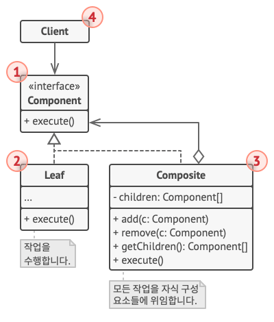

## Composite Pattern?

복합체 패턴은 복합 객체(Composite)와 단일 객체(Leaf)를 동일한 컴포넌트로 취급하여 클라이언트에게 이 둘을 구분하지 
않고 동일한 인터페이스를 사용하도록 만드는 디자인 패턴이다.

객체와 객체들 사이의 관계를 트리 구조로 정의해야할 때 유용하게 쓰인다.

- 이렇게 객체들을 트리 구조로 구성한 후, 단일 객체와 복합 객체를 동일한 객체로 취급하여 작업할 수 있게 된다.

 

## 구조

복합체 패턴의 전체적인 구조는 다음과 같다.

1. **Component**: 복합 객체(Composite)와 단일 객체(Leaf) 모두에 공통적인 작업을 제시하는 인터페이스이다.

2. **Leaf**: 단일 객체(단일 요소)이며, 트리의 leaf node와 같이 하위에 다른 요소가 존재하지 않는다.

3. **Composite**: 복합 객체로서, 하위 객체들을 소유할 수 있는 객체이다. 소유하고 있는 하위 객체들의 구상 클래스에 
대해 알지 못하며, Component 인터페이스를 통해서만 하위 객체들과 소통할 수 있다.

4. **Client**: Component 인터페이스를 통해 구조의 모든 요소들과 작동할 수 있으며, 단일 / 복합 객체를 하나의 
객체로서 다룰 수 있다.

복합체 패턴의 핵심은, Composite과 Leaf가 모두 Component 인터페이스의 추상 메서드(`execute()`)를 정의하고, 
Composite는 소유하고 있는 Component를 구현한 하위 객체들의 `execute()` 메서드를 실행하여 해당 객체들과 동작한다.
- 하위 객체들 중에는 또 다른 하위 Composite 객체가 존재할 수 있기 때문에 재귀 형태로 메서드를 호출하는 경우가 
생길 수 있다.

 

## 장단점

### 장점

- 복합 각체와 단일 객체를 동일하게 취급하기 때문에 함께 묶어서 관리하고자 할 때 편리하다.
- 다형성을 활용하여 트리 구조를 쉽게 만들 수 있다.
- OCP 준수 - 클라이언트는 Component 인터페이스만 알기 때문에 새로운 단일 객체가 추가되더라도 클라이언트에게는 전혀 
영향이 가지 않는다.

### 단점

- 트리 구조의 문제와 비슷하게, 깊이가 깊어질 수록 관리에 어려움이 생길 수 있다.
- 동일한 Component 인터페이스로 복합 객체와 단일 객체를 다루어야 하는데, 제약이 생기거나 설계가 까다로워질 경우가 
생긴다.
    - E.g. 복합 객체가 소유할 수 있는 객체들의 종류를 제한하고자 하는 경우

 

## 출처
https://refactoring.guru/ko/design-patterns/builder