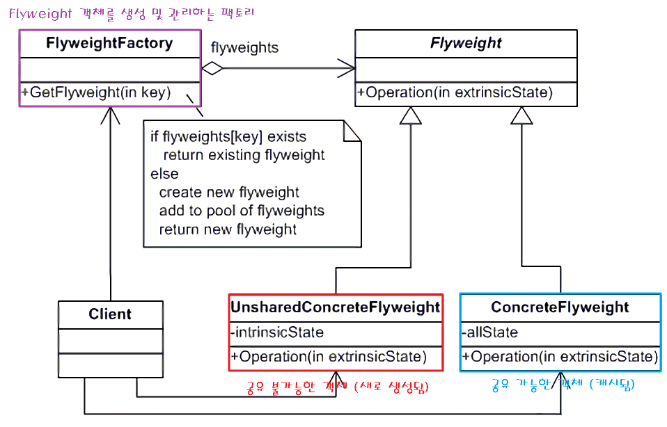

## Flyweight Pattern?

플라이웨이트 패턴은 각 객체에 모든 데이터를 유지하는 대신, 재사용 가능한 객체 인스턴스를 공유시켜 메모리 사용량을 최소화하는 디자인 패턴이다.

- 캐시의 개념과 비슷한 기능을 제공한다고 생각하면 된다.

 

## 구조

플라이웨이트 패턴의 전체적인 구조는 다음과 같다.

- **Flyweight**: 여러 객체들 간에 공유할 수 있는 원래 객체의 속성이 포함되어 있다.
    - 변하지 않는 속성(혹은 공유가 가능하여 재사용되는 객체)을 **intrinsic**, 자주 변하는 속성(따라서 공유가 불가능한 객체)을 **extrinsic**으로 표현한다.
    - Flyweight을 인터페이스로 만들고, intrinsic 객체와 extrinsic 객체를 따로 생성할 수 있다.
- **UnsharedConcreteFlyweight**: 공유 가능하여 재사용되는 객체이다 (intrinsic)
- **ConcreteFlyweight**: 공유 불가능한 객체이다 (extrinsic)
- **FlyweightFactory**: Flyweight 객체를 만드는 팩토리 기능과 캐시 역할을 하는 Flyweight 객체 관리 클래스이다.
    - getFlyweight()과 같은 메서드를 통해 이미 메모리에 존재하는 객체가 있다면 그대로 반환하고, 없다면 새로 생성 후 메모리에 저장하고 반환한다.

 

## 장단점

### 장점

- 애플리케이션에서 사용하는 메모리를 줄일 수 있다.
- 공유하는 객체 덕분에 프로그램의 속도를 개선할 수 있다.

### 단점

- 패턴을 구현하는 코드의 복잡도가 증가한다.

 

## 출처
- https://refactoring.guru/ko/design-patterns/builder
- https://inpa.tistory.com/entry/GOF-%F0%9F%92%A0-Flyweight-%ED%8C%A8%ED%84%B4-%EC%A0%9C%EB%8C%80%EB%A1%9C-%EB%B0%B0%EC%9B%8C%EB%B3%B4%EC%9E%90